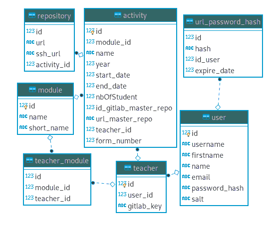

# Gestion de projet

Nous avons utilisé la fonctionnalité d’issue de Gitlab pour nous coordonner et
nous répartir le travail. Nous avons organisé les issues par release (encart
milestone de Gitlab) et avons assigné une personne (ou plusieurs dans certains
cas). Nous avons initialement utilisé aussi la possibilité de fixer des dates
pour les issues. Ceci s’est révélé être peu souple et inadapté à notre emploi du
temps : nous étions parfois amenés à avancer ou repousser une réunion et les
dates étaient alors incohérentes. Nous avons finalement passé en revue les issues 
ouvertes, qui constituaient un backlog des problèmes restants.

En ce qui concerne les réunions, nous avons fait le point sur l’avancement à
une fréquence hebdomadaire. Nous fusionnions les différentes branches, rangées
dans des Merge Requests (MR) Gitlab. Nous avons aussi souvent profité de ces
séances
pour travailler ensemble et nous mettre d’accord sur les parties communes de
l’application. Par exemple, nous avons dû décider du vocabulaire et de la
structure de la base de données en commun, puisque cela impactait tout le monde.

Enfin, chacun a pris en charge un nombre variable de pages. Les releases ont été faites sur les dernières
semaines du projet, car, du fait de cette parallélisation des tâches, nous
n’avons eu des ensembles de fonctionnalités cohérents qu’assez tardivement.

# Vocabulaire

Nous avons pris les entités suivantes dans la terminologie de l’application. On appelle :

- module : une matière telle que définie à Telecom Nancy
- activité : un projet d’un module, par exemple, le projet de la semaine bloquée de PCD. Il s'agira de l'entité maitre sur laquelle sera basée tous les dépôts des élèves pour cette activité.
- dépôt : dépôt git sur Giltab d’une activité, ou d'un groupe d'élève associé à une activité. Les dépôts des groupes d'élèves sont obtenus via un fork du dépôt de l'activité référente.

# Choix techniques

Nous avons choisi d’utiliser une base de données SQLite avec l’ORM SQLAlchemy.
SQLite présente l’avantage d’être extrêmement simple à installer et de ne pas
présenter de latence particulière, contrairement à une base de données de type
PostgreSQL. L’inconvénient de ce choix est qu’on ne pourrait pas avoir un grand
nombre d’utilisateurs et déployer plusieurs serveur avec la même application
pour un seul serveur de base de données, comme vu dans le MOOC.
Toutefois, cet inconvénient est minime, dans la mesure où peu d’utilisateurs
seront amenés à utiliser le service (quelques enseignants de Télécom Nancy).
De plus, l’ORM est générique et permettrait de passer à un autre moteur de base
de données de manière transparente, sans adaptation particulière de notre code.

De plus, nous faisons appel à l’API de Gitlab grâce à un wrapper Python.
Même si celle-ci n’est pas forcément toujours bien documentée, elle a permis un
gain de temps non-négligeable dans la mesure où les objets pour représenter les
différents concepts de Gitlab existaient déjà (dépôts, utilisateurs).

Nous utilisons aussi le framework CSS Bootstrap, ce qui a facilité la compatibilité mobile. Enfin, nous avons utilisé le framework Flask qui facilite le développement web en Python. 

# Modèle de la base de données

La table `user` contient les utilisateurs du site après inscription. Nous avons aussi la table `teacher` qui contient les clés d’API. Ce choix permet d’avoir des utilisateurs inscrits qui ne soient pas des enseignants, par exemple pour implémenter la fonctionnalité facultative d’interface pour les étudiants. Nous nous étions gardé cette possibilité même si nous n’avons finalement pas implémenté la fonctionnalité.

Les activités, conservées dans la table `activity`, contiennent une date de début et de fin ainsi que l’adresse du dépôt modèle à partir du quel les dépôts étudiants sont créés. On conserve aussi le nombre d’étudiant par groupe dans un dépot. Les dépôt sont conservés dans la table `repository` avec les urls necessaire pour aller sur la page web gitlab du dépôt et avec l’url ssh pour cloner le dépôt, pour la collecte de statistiques.

La table `module` conserve le nom long et l’abréviation d’un module et est référencée par l’activité. Chaque enseignant responsable de module est associé à celui-ci par la table `teacher_module`.

Une table supplémentaire, `url_password_hash`, a dû être ajouté pour stocker les urls de réinitialisation des mots de passe ainsi que leur date de réinitialisation. Il faut en effet contrôler que l’url de récupération du mot de passe n’ait pas expiré au moment où l’utilisateur accède à celle-ci.

# Routes de l’application

## Route : `/homepage`

La page **homepage** est la page d'accueil de Gitly, seul un message de bienvenue, le logo de Gitlab et la barre de navigation sont affichés sur cette page. Lorsque certains problèmes surviennent sur le site, il arrive que l'utilisateur soit redirigé sur cette page.

## Route : `signup`

Cette page permet à l’utilisateur d’entrer toutes les informations nécessaires
pour créer son compte et utiliser l’application. Nous avons choisi de ne pas
permettre à l’utilisateur qui vient de s’inscrire d’être directement connecté.

## Route `signin`

Il s’agit d’une page classique d’identification. On rentre l’utilisateur et le mot de passe. Il y a une fonction se souvenir de moi, ainsi que mot de passe oublié.

Les mots de passe ont été hachés et salés, pour respecter les bonnes pratiques en matière de sécurité. Il a donc fallu vérifier le mot de passe avec précautions, en hachant le mot de passe et en passant le sel dans la fonction hmac.

## Route : `/my_profile`

La page **my_profile** permet de présenter toutes les informations que l'application possède sur l'utilisateur. L'utilisateur peut également y modifier son mot de passe et y mettre à jour sa clé d'API Gitlab. On y trouve également la clé SSH que l'utilisateur doit ajouter à Gitlab pour pouvoir générer les statistiques des dépôts git des étudiants. Il peut aussi supprimer son compte de l'application. 

## Route : `/forgottenPassword`
 
Cette page permet de rentrer son adresse mail afin de réinitialiser son mot de passe. Une erreur sera affichée si aucun compte ne correspond à l'adresse mail renseignée. Si l'adresse est valable, un email est envoyé contenant un lien de réinitialisation du mot de passe. Le lien n'est valable que pour l'adresse mail renseignée et ceci pour une durée de 24 heures pour des raisons de sécurité. Si l'utilisateur demande une nouvelle fois à réinitialiser son mot de passe alors qu'un lien est toujours valable, ce même lien sera renvoyé. 

La majeure difficulté de la réalisation de cette page résidait dans le lien de réinitalisation du mot de passe afin qu'il ne soit valable que pour un utilisateur et ait une durée de validité. Il a aussi été difficile de gérer toutes les vérifications liées à ce lien avant et après l'envoi du mail.
 
## Route : `/reset_password/<hash_url>`
 
Cette page n'est accessible que depuis un lien de réinitialisation de mot de passe reçu par mail et seulement si ce lien est toujours valide. Il faut alors rentrer son nouveau mot de passe deux fois afin d'éviter toute erreur de frappe. 

## Route : `/home`

Cette page liste les activités qui concernent un professeur connecté. Si un utilisateur non connecté essaye d'accéder cette page, il est redirigé sur l'accueil. On utilise la pagination pour naviguer dans les entrées du tableau. Depuis cette page sont accessibles les pages des activités grâce aux liens situés à gauche de leur entrée dans le tableau. C'est à partir de cette page que se trouve le bouton permettant d'accéder à la page de création d'une activité.

## Route : `/home/newactivity`

Cette page n'est accessible que si l'utilisateur est connecté et que sa clé d'API est valide. Elle permet de créer une nouvelle activité. Il faut alors entrer : 

 - son nom,
 - ses dates de début et de fin,
 - le module associé : il est possible de choisir soit dans la liste des modules déjà existants, soit de créer un nouveau module en renseignant le nom long et le nom abrégé. L'affichage est intelligent, cela affiche le volet des modules existants s'il en existe au moins un, sinon cela affiche le volet de création d'un nouveau module.
 - l'enseignant référent : la liste des enseignants existants est affichée sous la forme d'une liste. Il suffit alors de cliquer sur l'enseignant que l'on souhaite affecter comme référent.
 - le nombre d'étudiants par groupe de l'activité : il s'agit ici de déterminer la cardinalité des groupes qui seront composés pour l'activité. Par exemple, si on choisit "un étudiant", chaque groupe ne sera composé que d'un élève, il y aura alors un dépôt par élève qui sera créé. Ce cas est idéal dans la création de TPs. Dans le cas des groupes avec plusieurs élèves, on peut choisir entre deux et six élèves. 
 - les élèves qui participeront à l'activité : il faut pour cela choisir un fichier au format CSV, ne comprenant pas d'en-tête et  contenant les champs suivants :
 
    | Nom | Prénom | Adresse mail | Nom d'utilisateur Gitlab |
    |-----|--------|--------------|--------------------------|

    Tous les élèves alors présents dans le fichier CSV sont chargés dans la colonne "Étudiants disponibles". Pour sélectionner plusieurs étudiants dans la liste, il suffit de garder la touche `CTRL` enfoncée et cliquer sur les étudiants désirés. Il faut alors déplacer les étudiants que l'on souhaite ajouter à l'activité dans la colonne "Étudiants de l'activité".Pour cela, quatre flèches sont disponibles :

    - **&larr;** et **&rarr;** : Permet de déplacer les étudiants sélectionnés d'une colonne à l'autre. 
    - **>** et **<** : Permet de déplacer tous les étudiants d'une colonne vers l'autre.
    
 Pour valider la création de l'activité, il faut cliquer ensuite sur le bouton "Créer l'activité" :

 - Le dépôt sur Gitlab de l'activité est créé 
 - Lorsqu'on créé des groupes avec un élève : pour tous les élèves renseignés, un nouveau dépôt est créé en effectuant un fork du dépôt de l'activité. 
 - Lorsqu'on crée des groupes avec plusieurs élèves : un lien est envoyé par mail à tous les étudiants renseignés afin qu'il créent leur groupe. Ce lien est unique pour une activité.

 Cette page a été une des plus complexes à réaliser et elle est centrale dans notre application. C'est sur cette page que nous avons eu le plus d'interactions en cascade avec l'API de Gitlab. Le front-end a aussi demandé une grande réflexion et une gestion dynamique du chargement du fichier CSV contenant la liste des élèves, ainsi que le déplacement d'une colonne à l'autre des élèves. Ceci a été permis grâce à du Javascript. Cette page gère aussi l'envoi de mails lorsque la cardinalité du groupe associé à l'activité est supérieure à 1. L'envoi de mail a été complexe a mettre en place car cela a nécessité de nombreux essais afin de connaitre la procédure (avec/sans authentification, SSL/TLS, (venus ou smtp).telecomnancy.eu).

## Route : `/newactivity/form/<form_number>`

Cette route affiche la page d'un formulaire de création de groupe pour les groupes comptant plus d'un élève. Elle est accessible pour toute personne disposant du lien (qui doit normalement avoir été reçu par mail pour les élèves concernés). Il n'y a pas besoin d'être connecté pour pouvoir accéder à cette page. Les élèves doivent alors renseigner :

 - Le nom de leur groupe
 - Le nom d'utilisateur Gitlab de chacun des membres du groupe
 
 Pour valider la création du groupe, il faut cliquer sur le bouton "Créer le groupe". Un dépôt sera alors créé via un fork du dépôt de l'activité, et en ajoutant tous les élèves en tant que "Développeur". Si un des noms d'utilisateur n'existe pas, le dépôt ne sera pas créé. 

 La difficulté de cette page a été de gérer le fait d'associer une URL à une activité. 

## Route `/activity/<int:activity_id>`

La page **activity** permet de présenter ce que l'on appelle une activité dans l'application. Une activité est un regroupement de dépôts gits géré par le professeur responsable de cette activité (par exemple un TP ou un projet). Une fois qu'une activité est créée, il n'est plus possible de la modifier (une amélioration possible serait de permettre la modification d'une activité). Sur la page d'une activité, on peut effectuer plusieurs actions :

- Accéder au dépôt maître de l'activité. C'est celui qui a été forké pour créer les dépôts des élèves, on peut donc le considérer comme le dépôt parent de tous les dépôts des groupes d'élèves appartenant à cette activité. 
- Accéder aux dépôts de chacun des élèves ou groupes d'élèves (selon le type d'activité)
- Accéder aux statistiques des dépôts des élèves ou groupes d'élèves (selon le type de l'activité)
- Créer une Merge Request d'une branche du dépôt parent et la répercuter sur les dépôts des élèves ou groupes d'élèves
- Créer des Issues sur une sélection de dépôts parmi les dépôts des élèves ou groupes d'élèves

L'une des principales difficultés rencontrée pour l'élaboration de cette page est la création de la Merge Request sur les dépôts des élèves. En effet, l'API de Gitlab ne permet pas de répercuter une Merge Request qui a été faite sur le dépôt parent sur les dépôts créé avec le fork. Il faut donc pour chaque dépôt copier l'intégralité de la branche dont on souhaite faire une Merge Request dans une nouvelle branche qui porte le même nom si celle-ci n'existe pas déjà et la renomme si c'est le cas (on peut également noter qu'à partir d'un certain nombre de branches, l'API de gitlab ne permet pas de récupérer l'intégralité des branches d'un dépôt et il devient donc impossible de vérifier que la branche n'existe pas déjà).
 
## Route : `/stats/<int:numéro_dépôt>`

Cette page permet d'afficher un certain nombre de statistiques liées au dépôt. On récupère ces statistiques à partir d'un fichier JSON produit par une exécution de la commande `gitinspector`, lancée sur un clone en SSH du dépôt considéré. On construit à partir de ces données :

- un histogramme des changements par auteur et par semaine en terme d'ajout,
- un deuxième histogramme, identique au premier mais avec les suppressions,
- un diagramme circulaire des responsabilités par ligne des changements sur la totalité du projet,
- un diagramme en barre de la part des changements en commentaire par auteur,
- un tableau indiquant la responsabilité par ligne sur chaque fichier par auteur.

Ces statistiques sont calculées uniquement pour le langage principal du dépôt, par exemple le langage C.
Les autres langages sont ignorés.

Les couleurs ont été choisies dans une palette pour être harmonieuses les unes
avec les autres. Pour un même utilisateur, une seule couleur est utilisée sur
tous les diagrammes.

# Particularités de l'application : 
## La pagination

La pagination sert pour les pages liées aux activités afin de limiter le nombre de dépôts ou d'activités à l'écran en même temps et de faciliter la navigation. La liste des entrées du tableau est calculée dynamiquement en ne faisant des requêtes que sur la partie concernée. Pour l'interface on crée un itérable qui indique quels numéros de page sont cliquables en dessous du tableau. Enfin on se sert de l'URL pour savoir à quelle page l'utilisateur se situe.

La manipulation des itérables en Python nous nous était pas familière, il nous a fallu faire quelques recherches dans la documentation.

## Menu de navigation

Une barre de navigation est en permanence affichée en haut du site. À partir de celle-ci un utilisateur connecté peut se déplacer vers sa page d'accueil (liste de ses activités) ou son profil, et se déconnecter. Un utilisateur non connecté peut s'inscrire, revenir à la page d'accueil ou se connecter. Le menu est différent en fonction de si l'utilisateur est connecté ou non.

## Gestion de comptes

Les accès utilisateurs sont gérés avec un système de comptes, protégés par mot de passe. Ceux-ci sont hachés et salés, on n'en conserve que le hash dans la base de données. L'utilisateur a la possibilité de supprimer son compte de l'application et de gérer son mot de passe et clé d'API.

## Connexion avec Gitlab

Le service vérifie en permanence la validité de la clé d'API fournie. Si la clé d'API de l'utilisateur n'est plus valide, celui-ci se trouve alors redirigé sur la page de profil pour en changer.

# Non déploiement sur Google App Engine

Nous n'avons pas effectué le déploiement de l'application sur Google App Engine pour plusieurs raisons :

- nous avons commencé le projet sans penser au déploiement et nous n'avons donc pas utilisé les outils de Google
- les permissions sur un serveur de ce type ne sont pas représentatives de celles que l'on aurait si on était si le site était déployé depuis les serveurs de l'école.

Aussi, pour que le déploiement sur Google App Engine soit possible et fonctionnel au même niveau que celui sur Heroku, il aurait fallu que nous utilisions le Cloud de google pour la base de données et surtout pour cloner les dépôts des élèves dont on veut récupérer les statistiques. La limite de taille offerte par le Cloud de Google étant assez faible, nous avons estimé qu'il serait difficile d'envisager une utilisation sur le long terme de cette solution sachant que l'application devrait être déployé sur les serveurs de l'école.

# Sources

- https://www.sqlalchemy.org/, documentation de l’ORM
- http://flask-sqlalchemy.pocoo.org/2.3/quickstart/
- https://getbootstrap.com/docs/4.3/getting-started/introduction/ Documentation bootstrap
- https://openclassrooms.com/fr/courses/2984401-apprenez-a-coder-avec-javascript
- https://devdocs.io/javascript/
- http://flask.pocoo.org/docs/1.0/quickstart/
- https://www.w3schools.com/
- https://docs.python.org/3/
- https://material.io/tools/icons/?search=G&icon=label_important&style=sharp

